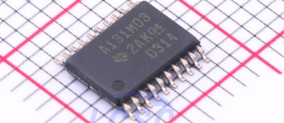

<center>


Created by Ouroboros Embedded Education.
</center>

## Versions Changelog

V1.0.0

- Initial Release

# ADS131M0x Driver Library Documentation

<center></center>

This documentation covers the C driver for the Texas Instruments ADS131M0x family of multi-channel, simultaneous-sampling, 24-bit delta-sigma ADCs. The driver is modular, hardware-agnostic, and supports flexible configuration for embedded applications.

---

## Table of Contents

- [ADS131M0x Driver Library Documentation](#ads131m0x-driver-library-documentation)
  - [Table of Contents](#table-of-contents)
  - [Overview](#overview)
  - [Features](#features)
  - [File Structure](#file-structure)
  - [Configuration Macros](#configuration-macros)
  - [Register Map](#register-map)
  - [Data Types](#data-types)
  - [Function Pointer Abstraction](#function-pointer-abstraction)
  - [API Reference](#api-reference)
    - [Initialization](#initialization)
    - [Register Access](#register-access)
    - [Channel Configuration](#channel-configuration)
    - [Sampling and Power](#sampling-and-power)
    - [Data Acquisition](#data-acquisition)
  - [Usage Example](#usage-example)
  - [Notes](#notes)
  - [License](#license)

---

## Overview

The ADS131M0x driver provides a portable interface for configuring, controlling, and reading data from ADS131M0x ADCs. It abstracts SPI, GPIO, and timing operations via user-supplied function pointers, allowing seamless integration into various MCU platforms.

The library detect the device ID and auto set the AD channels.

---

## Features

- Supports up to 8 channels (auto detected).
- Hardware abstraction for SPI, GPIO (CS, SYNC/RESET), and delays.
- Register read/write and command interface.
- Channel gain, enable/disable, and multiplexer configuration.
- Oversampling ratio and power mode selection.
- Raw and voltage output for all channels.
- IRQ (interrupt) support for high-speed data transfer.
- Thread safety via optional lock/unlock functions.

---

## File Structure

- **ADS131M0x.h**: Public API, register map, macros, type definitions.
- **ADS131M0x.c**: Implementation of all driver functions and internal logic.

---

## Configuration Macros

- `ADS131_MAX_CHANNELS_CHIPSET`
Maximum number of channels supported (default: 8).
- `ADS131_USE_DOUBLE_PRECISION`
Define to use `double` for voltage calculations; otherwise, `float` is used.
- Command and register macros (examples):

```c
#define ADS131_CMD_RESET    0x0011
#define ADS131_CMD_RREG     0xA000
#define ADS131_REG_ID       0x00
#define ADS131_REG_STATUS   0x01
// ... (see header for full list)
```


---

## Register Map

The header defines all ADS131M0x command and register addresses, including global and per-channel registers (e.g., `ADS131_REG_CH0_CFG`, `ADS131_REG_GAIN1`, etc.).

---

## Data Types

- **ads131_t**: Main device handle, containing configuration, function pointers, and internal state.
- **ads131_err_e**: Error/status codes (e.g., `ADS131_OK`, `ADS131_FAILED`, `ADS131_UNKNOWN`, etc.).
- **ads131_channel_e**: Channel enumeration.
- **ads131_gain_e**: Gain setting enumeration.
- **ads131_osr_value_e**: Oversampling ratio enumeration.
- **ads131_power_mode_e**: Power mode enumeration.
- **ads131Float_t**: Floating-point type for voltage (configurable as `float` or `double`).
- **ads131_channels_val_t**: Structure holding raw and voltage values for all channels.

---

## Function Pointer Abstraction

The driver uses user-supplied function pointers for all hardware-dependent operations:

- `SPITransfer(tx, rx, len)`: SPI transfer.
- `SPITransferIRQ(tx, rx, len)`: SPI transfer for IRQ context (optional).
- `CSPin(state)`: Chip select control.
- `SYNCPin(state)`: SYNC/RESET control (optional).
- `DelayMs(ms)`: Millisecond delay.
- `Lock() / Unlock()`: Mutex for thread safety (optional).

---

## API Reference

### Initialization

```c
ads131_err_e ads131_init(ads131_t *Ads131);
```

Initializes the device, performs hardware reset, reads device ID, and sets up internal configuration.

---

### Register Access

```c
ads131_err_e ads131_write_reg(ads131_t *Ads131, uint32_t reg, uint16_t val);
ads131_err_e ads131_read_reg(ads131_t *Ads131, uint32_t reg, uint16_t *val);
```

Write/read a 16-bit value to/from a device register.

---

### Channel Configuration

```c
ads131_err_e ads131_set_gain(ads131_t *Ads131, ads131_channel_e Channel, ads131_gain_e GainLevel);
ads131_err_e ads131_set_channel_enable(ads131_t *Ads131, ads131_channel_e Channel, ads131_enable_e Enable);
ads131_err_e ads131_set_mux(ads131_t *Ads131, ads131_channel_e Channel, ads131_mux_e Mux);
```

Set channel gain, enable/disable a channel, or configure the input multiplexer.

---

### Sampling and Power

```c
ads131_err_e ads131_set_osr(ads131_t *Ads131, ads131_osr_value_e Osr);
ads131_err_e ads131_set_power_mode(ads131_t *Ads131, ads131_power_mode_e PowerMode);
```

Set oversampling ratio or power mode.

---

### Data Acquisition

```c
ads131_err_e ads131_read_all_channel(ads131_t *Ads131, ads131_channels_val_t *val);
ads131_err_e ads131_read_one_channel(ads131_t *Ads131, ads131_channel_e Channel, uint32_t *raw, ads131Float_t *miliVolt);
ads131_err_e ads131_read_all_channel_irq(ads131_t *Ads131);
ads131_channels_val_t ads131_spi_transfer_irq(ads131_t *Ads131);
```

Read all or one channel's raw and voltage data; IRQ versions for interrupt-driven acquisition.

---

## Usage Example

```c
#include "ADS131M0x.h"

ads131_t adc;

// Fill in function pointers for your hardware
adc.fxn.SPITransfer = my_spi_transfer;
adc.fxn.CSPin      = my_cs_pin;
adc.fxn.DelayMs    = my_delay_ms;
// Optionally: SYNCPin, Lock, Unlock

if (ads131_init(&adc) == ADS131_OK) {
    ads131_channels_val_t values;
    if (ads131_read_all_channel(&adc, &values) == ADS131_OK) {
        for (int i = 0; i < adc.nChannels; ++i) {
            printf("Ch%d: Raw=0x%06lX, Voltage=%.2fmV\n",
                   i, values.ChannelRaw[i], values.ChannelVoltageMv[i]);
        }
    }
}
```


---

## Notes

- **Thread Safety:** If used in a multithreaded context, provide `Lock` and `Unlock` functions.
- **IRQ Support:** For high-speed or interrupt-driven applications, use the IRQ-specific SPI transfer and read functions.
- **Channel Count:** Set `ADS131_MAX_CHANNELS_CHIPSET` as needed, but not greater than 8.
- **Reference Voltage:** Default is 1200.0 mV; adjust if using a different reference.

---

## License

See source files for license details.
Author: Pablo Jean (pablo-jean), March 2024

---

**For detailed register definitions, enumerations, and additional configuration, refer to the comments and code in `ADS131M0x.h` and `ADS131M0x.c`.**
